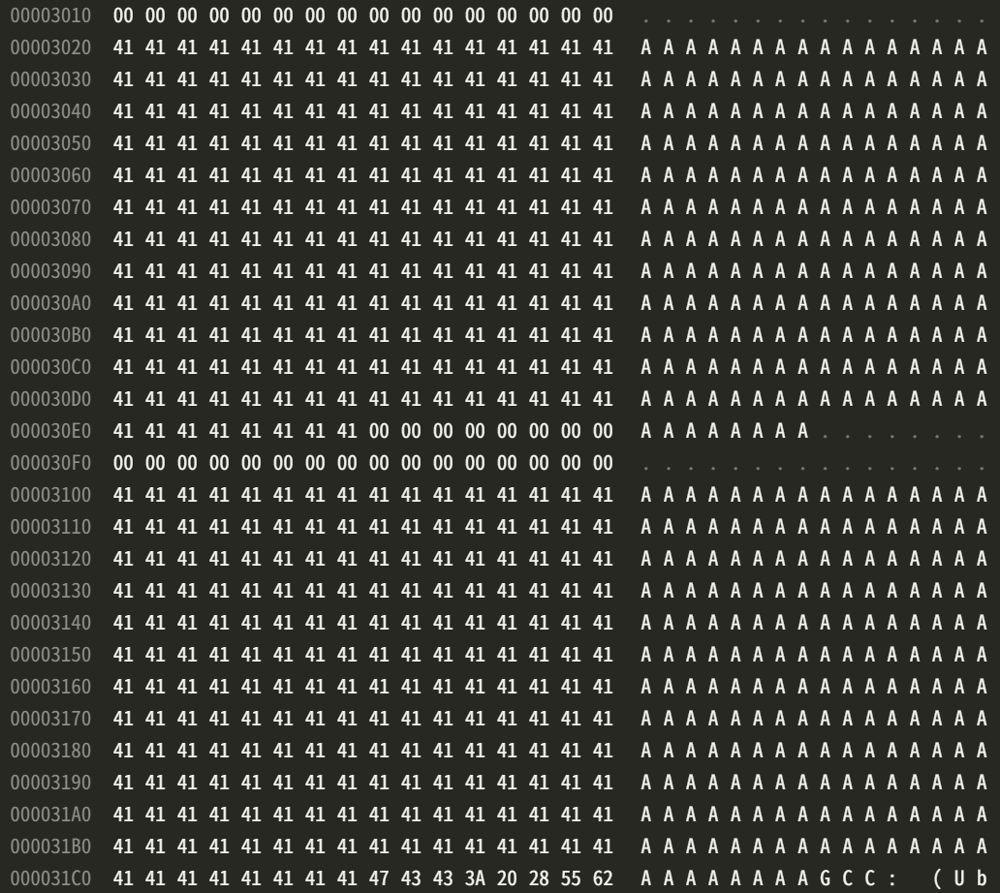

# 2 Secret-Key Encryption

## 2.1 Task 1: Frequency Analysis Against Monoalphabetic Substitution Cipher

Using the online tool [dcode.fr](https://www.dcode.fr/frequency-analysis), we can perform frequency analysis on `ciphertext.txt`.

The frequency in the ciphertext is as follows (from most frequent to least frequent):

```
nyvxuqmhtipaczlgbredfskjow
```


The frequency in English is as follows (from most frequent to least frequent), as given by dcode.fr:

```
etaoinshrldcumwfgypbvkjxqz
```


We can find the encryption key used by constructing a one-to-one mapping between the two frequency lists:

```
vgapnbrtmosicuxewhqyzflkdj
```

We can decrypt the ciphertext using `tr`:

```bash
tr 'vgapnbrtmosicuxewhqyzflkdj' 'abcdefghijklmnopqrstuvwxyz' < ciphertext.txt > plaintext.txt
```

And the decrypted plaintext is:

```
the oscars turn  on sunday which seems about right after this long strange
awards trip the bagger feels like a nonagenarian too

the awards race was bookended by the demise of harvey weinstein at its outset
and the apparent implosion of his film company at the end and it was shaped by
the emergence of metoo times up blackgown politics armcandy activism and
a national conversation as brief and mad as a fever dream about whether there
ought to be a president winfrey the season didnt just seem extra long it was
extra long because the oscars were moved to the first weekend in march to
avoid conflicting with the closing ceremony of the winter olympics thanks
pyeongchang

one big zuestion surrounding this years academy awards is how or if the
ceremony will address metoo especially after the golden globes which became
a jubilant comingout party for times up the movement spearheaded by 
powerful hollywood women who helped raise millions of dollars to fight sexual
harassment around the country

signaling their support golden globes attendees swathed themselves in black
sported lapel pins and sounded off about sexist power imbalances from the red
carpet and the stage on the air e was called out about pay inezuity after
its former anchor catt sadler zuit once she learned that she was making far
less than a male cohost and during the ceremony natalie portman took a blunt
and satisfying dig at the allmale roster of nominated directors how could
that be topped

as it turns out at least in terms of the oscars it probably wont be

women involved in times up said that although the globes signified the
initiatives launch they never intended it to be just an awards season
campaign or one that became associated only with redcarpet actions instead
a spokeswoman said the group is working behind closed doors and has since
amassed  million for its legal defense fund which after the globes was
flooded with thousands of donations of  or less from people in some 
countries


no call to wear black gowns went out in advance of the oscars though the
movement will almost certainly be referenced before and during the ceremony 
especially since vocal metoo supporters like ashley judd laura dern and
nicole kidman are scheduled presenters

another feature of this season no one really knows who is going to win best
picture arguably this happens a lot of the time inarguably the nailbiter
narrative only serves the awards hype machine but often the people forecasting
the race socalled oscarologists can make only educated guesses

the way the academy tabulates the big winner doesnt help in every other
category the nominee with the most votes wins but in the best picture
category voters are asked to list their top movies in preferential order if a
movie gets more than  percent of the firstplace votes it wins when no
movie manages that the one with the fewest firstplace votes is eliminated and
its votes are redistributed to the movies that garnered the eliminated ballots
secondplace votes and this continues until a winner emerges

it is all terribly confusing but apparently the consensus favorite comes out
ahead in the end this means that endofseason awards chatter invariably
involves tortured speculation about which film would most likely be voters
second or third favorite and then ezually tortured conclusions about which
film might prevail

in  it was a tossup between boyhood and the eventual winner birdman
in  with lots of experts betting on the revenant or the big short the
priqe went to spotlight last year nearly all the forecasters declared la
la land the presumptive winner and for two and a half minutes they were
correct before an envelope snafu was revealed and the rightful winner
moonlight was crowned

this year awards watchers are unezually divided between three billboards
outside ebbing missouri the favorite and the shape of water which is
the baggers prediction with a few forecasting a hail mary win for get out

but all of those films have historical oscarvoting patterns against them the
shape of water has  nominations more than any other film and was also
named the years best by the producers and directors guilds yet it was not
nominated for a screen actors guild award for best ensemble and no film has
won best picture without previously landing at least the actors nomination
since braveheart in  this year the best ensemble sag ended up going to
three billboards which is significant because actors make up the academys
largest branch that film while divisive also won the best drama golden globe
and the bafta but its filmmaker martin mcdonagh was not nominated for best
director and apart from argo movies that land best picture without also
earning best director nominations are few and far between
```

## 2.2 Task 2: Encryption using Different Ciphers and Modes

In this experiment, the content of `plain.txt` is:

```
0The 1quick 2brown 3fox 4jumps 5over 6the 7lazy 8dog 9.
```

(1) AES-128-CBC

In AES-128-CBC, IV should be 32 bytes long.

```bash
openssl enc -aes-128-cbc -e -in plain.txt -out cipher -K 9f86d081884c7d659a2feaa0c55ad015 -iv f2e5a7c4d9f03d4a2b8c4e7f9e5a7c4d
openssl enc -aes-128-cbc -d -in cipher -out decrypted.txt -K 9f86d081884c7d659a2feaa0c55ad015 -iv f2e5a7c4d9f03d4a2b8c4e7f9e5a7c4d
xxd -p cipher
```

The ciphertext in hex is:

```
716c4a01d8246ccc1d2c916336fc07834a2f57b9f8d1e6f66a6f5cd2d13b
2259b989a3fefaa9f7cbb7cf428e7d81e79f1c0da741eaf547ba1aeb7813
2e1934b5
```

And the decrypted text is the same as the plaintext: (same for all the following tests)

```
0The 1quick 2brown 3fox 4jumps 5over 6the 7lazy 8dog 9.
```

(2) AES-128-ECB

In AES-128-ECB, IV is not used.

```bash
openssl enc -aes-128-ecb -e -in plain.txt -out cipher -K 9f86d081884c7d659a2feaa0c55ad015
openssl enc -aes-128-ecb -d -in cipher -out decrypted.txt -K 9f86d081884c7d659a2feaa0c55ad015
xxd -p cipher
```

The ciphertext in hex is:

```
2f65c2d94f1a21f0932f199fd733fbffc2495167f08c9aeacf061b64139a
4c80026c92174cd23d8c666a2afc56ede837b9fd08e5c97468f2645678c0
47c5d1c5
```

And the decrypted text is the same as the plaintext.

(3) CAMELLIA-128-CFB1

```bash
openssl enc -camellia-128-cfb1 -e -in plain.txt -out cipher -K 9f86d081884c7d659a2feaa0c55ad015 -iv f2e5a7c4d9f03d4a2b8c4e7f9e5a7c4d
openssl enc -camellia-128-cfb1 -d -in cipher -out decrypted.txt -K 9f86d081884c7d659a2feaa0c55ad015 -iv f2e5a7c4d9f03d4a2b8c4e7f9e5a7c4d
xxd -p cipher
```

The ciphertext in hex is:

```
3e4b1f85f339e7858536ef2d8f1422ec811d0516a3f3110f67b8e095da44
19c383f5d963f15aa3d519a79c1681ff80c927d80222cc0358
```

And the decrypted text is the same as the plaintext.

## 2.3 Task 3: Encryption Mode – ECB vs. CBC

(1) ECB

```bash
openssl enc -aes-128-ecb -e -in pic_original.bmp -out pic_ecb -K 6D0AF57AD8BD9D455AF09624FAD5D461
head -c 54 pic_original.bmp > header
tail -c +55 pic_ecb > body
cat header body > pic_ecb.bmp
```

(2) CBC

```bash
openssl enc -aes-128-cbc -e -in pic_original.bmp -out pic_cbc -K C4A252F9B5CAC1789171026273F2FD98 -iv D2BA62CFD443046D7808FADCB38A47FC
head -c 54 pic_original.bmp > header
tail -c +55 pic_cbc > body
cat header body > pic_cbc.bmp
```

(3) Observations

Repeated the experiment with another picture, it can be observed that:

- ECB has repeating patterns in the encrypted picture, which can be used to identify the outline of the original image.
- CBC encrypted image reveals no information about the original image.

The comparison of the original image, ECB encrypted image, and CBC encrypted image is shown below:


## 2.4 Task 4: Padding

(1) Testing with different modes

```bash
echo -n "0The 1quick 2brown 3fox 4jumps 5over 6the 7lazy 8dog 9." > f0.txt
openssl enc -aes-128-ecb -e -in f0.txt -out f0_ecb -K F7C283CB02B7ECB9C54C1A05ED317C37 -nopad
openssl enc -aes-128-cbc -e -in f0.txt -out f0_cbc -K F7C283CB02B7ECB9C54C1A05ED317C37 -iv 1EF936534B0E9CEF2CE4AF5EAD8188DC -nopad
openssl enc -aes-128-cfb -e -in f0.txt -out f0_cfb -K F7C283CB02B7ECB9C54C1A05ED317C37 -iv 1EF936534B0E9CEF2CE4AF5EAD8188DC -nopad
openssl enc -aes-128-ofb -e -in f0.txt -out f0_ofb -K F7C283CB02B7ECB9C54C1A05ED317C37 -iv 1EF936534B0E9CEF2CE4AF5EAD8188DC -nopad
```

Observations:

| Mode | Padding |
| --- | --- |
| ECB | Yes |
| CBC | Yes |
| CFB | No |
| OFB | No |

Explanation: ECB and CBC are block ciphers, which require the input to be a multiple of the block size. Therefore, padding is needed to fill the last block. While CFB and OFB are stream ciphers, which process the input byte by byte, so no padding is needed.

(2) Padding experiment

```bash
echo -n "12345" > f1.txt
openssl enc -aes-128-cbc -e -in f1.txt -out f1_cbc -K C555F595680FE452DE6EC435B5FBBC2F -iv 155AEB60093BF63520FE48B0C396C04D
openssl enc -aes-128-cbc -d -in f1_cbc -out f1_cbc_dec -K C555F595680FE452DE6EC435B5FBBC2F -iv 155AEB60093BF63520FE48B0C396C04D -nopad
xxd f1_cbc_dec

echo -n "1234567890" > f2.txt
openssl enc -aes-128-cbc -e -in f2.txt -out f2_cbc -K C555F595680FE452DE6EC435B5FBBC2F -iv 155AEB60093BF63520FE48B0C396C04D
openssl enc -aes-128-cbc -d -in f2_cbc -out f2_cbc_dec -K C555F595680FE452DE6EC435B5FBBC2F -iv 155AEB60093BF63520FE48B0C396C04D -nopad
xxd f2_cbc_dec

echo -n "1234567890abcdef" > f3.txt
openssl enc -aes-128-cbc -e -in f3.txt -out f3_cbc -K C555F595680FE452DE6EC435B5FBBC2F -iv 155AEB60093BF63520FE48B0C396C04D
openssl enc -aes-128-cbc -d -in f3_cbc -out f3_cbc_dec -K C555F595680FE452DE6EC435B5FBBC2F -iv 155AEB60093BF63520FE48B0C396C04D -nopad
xxd f3_cbc_dec
```

Result:

```
00000000: 3132 3334 350b 0b0b 0b0b 0b0b 0b0b 0b0b  12345...........

00000000: 3132 3334 3536 3738 3930 0606 0606 0606  1234567890......

00000000: 3132 3334 3536 3738 3930 6162 6364 6566  1234567890abcdef
00000010: 1010 1010 1010 1010 1010 1010 1010 1010  ................
```

Conclusion: 

- For `f1_cbc`, the encrypted file size is 16 bytes, and the padding is `0b`.
- For `f2_cbc`, the encrypted file size is 16 bytes, and the padding is `06`.
- For `f3_cbc`, the encrypted file size is 32 bytes, and the padding is `10`.

## 2.5 Task 5: Error Propagation – Corrupted Cipher Text

(1) Theoretical analysis

In AES-128, the block size is 128 bits (16 bytes). The corrupted position is the 55th byte. Its offset is 54 = 0x36, and the block address is from `0x30` to `0x3f`.

- ECB: The corrupted byte will affect the entire block, as each block is encrypted independently.
    - Affected range: `0x30` to `0x3f`.
- CBC: The corrupted byte will affect this and the next block, as each block is XORed with the previous ciphertext block.
    - Affected range: `0x30` to `0x4f`.
- CFB: The corrupted byte will affect all bytes from that byte till the end of the next block, as the ciphertext is XORed with the plaintext to generate the next ciphertext.
    - Affected range: `0x36` to `0x4f`.
- OFB: The corrupted byte will affect only that byte, as the keystream is generated independently of the plaintext.
    - Affected range: `0x36`.

(2) Experiment


Results presented with `xxd`:

```
xxd -s 48 -l 48 plaintext.txt
00000030: 6874 2061 6674 6572 2074 6869 7320 6c6f  ht after this lo
00000040: 6e67 2073 7472 616e 6765 0a61 7761 7264  ng strange.award
00000050: 7320 7472 6970 2074 6865 2062 6167 6765  s trip the bagge

xxd -s 48 -l 48 ecb_decrypted.txt 
00000030: 7c0a 7e44 588c 7046 1e33 55bd e56b d265  |.~DX.pF.3U..k.e
00000040: 6e67 2073 7472 616e 6765 0a61 7761 7264  ng strange.award
00000050: 7320 7472 6970 2074 6865 2062 6167 6765  s trip the bagge

xxd -s 48 -l 48 cbc_decrypted.txt 
00000030: 799b f26f 0aae a791 6a67 b0f7 f92b 6653  y..o....jg...+fS
00000040: 6e67 2073 7472 606e 6765 0a61 7761 7264  ng str`nge.award
00000050: 7320 7472 6970 2074 6865 2062 6167 6765  s trip the bagge

xxd -s 48 -l 48 cfb_decrypted.txt 
00000030: 6874 2061 6674 6472 2074 6869 7320 6c6f  ht aftdr this lo
00000040: 68e5 4dc5 a45c 5525 37a4 faec be98 7631  h.M..\U%7.....v1
00000050: 7320 7472 6970 2074 6865 2062 6167 6765  s trip the bagge

xxd -s 48 -l 48 ofb_decrypted.txt 
00000030: 6874 2061 6674 6472 2074 6869 7320 6c6f  ht aftdr this lo
00000040: 6e67 2073 7472 616e 6765 0a61 7761 7264  ng strange.award
00000050: 7320 7472 6970 2074 6865 2062 6167 6765  s trip the bagge
```

The altered byte is `0x36` (the `e` in `after`).

Conclusion:

- For ECB, the affected range is `0x30` to `0x3f`.
- For CBC, the affected range is `0x30` to `0x4f`.
- For CFB, the affected range is `0x36` to `0x4f`.
- For OFB, the affected range is `0x36`.

The results are consistent with the theoretical analysis.

## 2.6 Task 6: Initialization Vector (IV)

#### Task 6.1

(1) Using two different IVs

```bash
echo -n "0The 1quick 2brown 3fox 4jumps 5over 6the 7lazy 8dog 9." > f0.txt
openssl enc -aes-128-cbc -e -in f0.txt -out f0_cbc_iv1 -K BF8540A1A3AE40F7943D4CFE0AF0B8F6 -iv 1B5DA6F6FCDD0A7C7E3596E4C7DC22F8 -base64
openssl enc -aes-128-cbc -e -in f0.txt -out f0_cbc_iv2 -K BF8540A1A3AE40F7943D4CFE0AF0B8F6 -iv 88F49AED20C6C4D62DC25D468963C283 -base64
diff f0_cbc_iv1 f0_cbc_iv2
```

Note: The `-base64` option is used to simplify the comparison.

Result: The two ciphertexts are different. Terminal output:

```
1,2c1,2
< EtTMQb44rQsnqlj0COF3QmXMmChIKK3z8Oaeok19cfWtfGepjNLqnSAtkQnCfYBs
< qIE2Fsg6RhtkbOuCkDGVJQ==
---
> gofipdhKi90jDKsFuT8pznQgH3rJECldEkLiEC2J51FVO6zcQB1uyneAxiA9Mvsr
> ST85F8gPfCAoAWNlnKWBlA==
```

(2) Using the same IV

```bash
openssl enc -aes-128-cbc -e -in f0.txt -out f0_cbc_iv3 -K BF8540A1A3AE40F7943D4CFE0AF0B8F6 -iv 1B5DA6F6FCDD0A7C7E3596E4C7DC22F8 -base64
openssl enc -aes-128-cbc -e -in f0.txt -out f0_cbc_iv4 -K BF8540A1A3AE40F7943D4CFE0AF0B8F6 -iv 1B5DA6F6FCDD0A7C7E3596E4C7DC22F8 -base64
diff f0_cbc_iv3 f0_cbc_iv4
```

Result: The two ciphertexts are the same. No output.

Observation: If the same IV is used, the ciphertext will be the same given other parameters are the same.

Explanation: In CBC mode, $C_0 = IV, C_i = E_K(P_i \oplus C_{i-1})$. If the same IV is used, the first block will have the same ciphertext $C_1 = E_K (P_1 \oplus IV)$, and so does the subsequent blocks. Reusing IV under the same key will lead to the same ciphertext, which may leak information about the plaintext.

#### Task 6.2

In OFB, if the key and IV is known to be fixed, the keystream will be the same regardless of the plaintext. Therefore, we can use XOR to compute the keystream from $(C1, P1)$, which can be used to decrypt $C2$ to reveal $P2$.

$\text{Keystream} = C1 \oplus P1$

$P2 = C2 \oplus \text{Keystream}$

Implemented using Python:

```python
def xor_bytes(a, b):
    return bytes(x ^ y for x, y in zip(a, b))

P1 = b'This is a known message!'
C1 = bytes.fromhex('a469b1c502c1cab966965e50425438e1bb1b5f9037a4c159')
keystream = xor_bytes(C1, P1)
C2 = bytes.fromhex('bf73bcd3509299d566c35b5d450337e1bb175f903fafc159')
P2 = xor_bytes(C2, keystream)
print(P2.decode())
```

The result is:

```
Order: Launch a missile!
```

If CFB is used instead of OFB, the first block (In AES-128-CFB, it's 16 bytes) of $P2$ can be revealed. This is because while all subsequent blocks rely on the previous ciphertext block, the first block is only XORed with the IV, making the keystream of the first block independent of the plaintext.


#### Task 6.3

In CBC mode, $C_0 = IV, C_i = E_K(P_i \oplus C_{i-1})$. Since the message is shorter than a block, we have $C1 = E_K(P1 \oplus IV1)$, $C2 = E_K(P2 \oplus IV2)$.

We first assume $P1 = \text{Yes}$. Then we can construct $P2$ such that $P2 \oplus IV2 = P1 \oplus IV1$, so $C2 = E_K(P2 \oplus IV2) = E_K(P1 \oplus IV1) = C1$.

Therefore the constructed $P2 = P1 \oplus IV1 \oplus IV2$. By verifying if $C1 = C2$, we can determine if $P1 = \text{Yes}$. We need to first pad the plaintext to the block size, and then perform the XOR operation.

Implemented using Python:

```python
def xor_bytes(a, b):
    return bytes(x ^ y for x, y in zip(a, b))

P1 = b'Yes'
IV1 = bytes.fromhex('31323334353637383930313233343536')
IV2 = bytes.fromhex('31323334353637383930313233343537')

def PKCS7_padding(data, block_size):
    padding = block_size - len(data) % block_size
    return data + bytes([padding] * padding)

P1_padded = PKCS7_padding(P1, 8)
P2 = xor_bytes(xor_bytes(P1, IV1), IV2)
print(P2.hex())
```

The constructed P2, viewed with `xxd`, is:

```
00000000: 5965 730d 0d0d 0d0d 0d0d 0d0d 0d0d 0d0c  Yes.............
```

We can confirm the correctness by simulating the subsequent steps. Bob encrypts P2 with IV2 to get C2, and Eve intercepts C2:

```bash
openssl enc -aes-128-cbc -e -in p2.txt -out c2.bin -K 00112233445566778899aabbccddeeff -iv 31323334353637383930313233343537
xxd -p c2.bin
```

The result is:

```
00000000: bef6 5565 572c cee2 a9f9 5531 54ed 9498  ..UeW,....U1T...
00000010: 3402 de3f 0dd1 6ce7 89e5 4757 79ac a405  4..?..l...GWy...
```

It can be verified that the first 16 bytes of C2 are the same as C1, which means out assumption is correct, and the value of P1 is "Yes".

## 2.7 Task 7: Programming using the Crypto Library

C Code:

```c
#include <stdio.h>
#include <stdlib.h>
#include <string.h>
#include <openssl/evp.h>

const char *IV_HEX = "aabbccddeeff00998877665544332211";
const char *CIPHERTEXT_HEX = "764aa26b55a4da654df6b19e4bce00f4ed05e09346fb0e762583cb7da2ac93a2";
const char *PLAINTEXT = "This is a top secret.";
const size_t KEY_SIZE = 16;
const size_t BLOCK_SIZE = 16;
const size_t CIPHERTEXT_SIZE = 32;

void hex_to_bytes(const char *hex, unsigned char *bytes) {
    for (size_t i = 0; i < strlen(hex) / 2; i++) {
        sscanf(&hex[2 * i], "%2hhx", &bytes[i]);
    }
}

void pad_key(const char *word, unsigned char *key) {
    size_t len = strlen(word);
    memcpy(key, word, len);
    memset(key + len, '#', KEY_SIZE - len);
}

int decrypt(const unsigned char *ciphertext, const unsigned char *key, const unsigned char *iv, unsigned char *plaintext) {
    EVP_CIPHER_CTX *ctx = EVP_CIPHER_CTX_new();
    if (!ctx) return 0;

    int len;
    int plaintext_len;

    if (!EVP_DecryptInit_ex(ctx, EVP_aes_128_cbc(), NULL, key, iv))
        return 0;

    if (!EVP_DecryptUpdate(ctx, plaintext, &len, ciphertext, CIPHERTEXT_SIZE))
        return 0;
    plaintext_len = len;

    if (!EVP_DecryptFinal_ex(ctx, plaintext + len, &len))
        return 0;
    plaintext_len += len;

    EVP_CIPHER_CTX_free(ctx);

    plaintext[plaintext_len] = '\0';
    return plaintext_len;
}

int main() {
    FILE *file = fopen("words.txt", "r");
    if (!file) {
        fprintf(stderr, "Could not open words.txt\n");
        return 1;
    }

    unsigned char iv[BLOCK_SIZE];
    unsigned char ciphertext[CIPHERTEXT_SIZE];
    unsigned char key[KEY_SIZE];
    unsigned char decrypted_text[CIPHERTEXT_SIZE];

    hex_to_bytes(IV_HEX, iv);
    hex_to_bytes(CIPHERTEXT_HEX, ciphertext);

    char word[KEY_SIZE];
    int len;
    while (fgets(word, sizeof(word), file)) {
        word[strcspn(word, "\n")] = '\0';
        len = strlen(word);

        if (len == 0)
            continue;
        if (word[len - 1] == '\r') {
            word[len - 1] = '\0';
            len--;
        }
        if (len == 0 || len > KEY_SIZE)
            continue;

        pad_key(word, key);

        if (decrypt(ciphertext, key, iv, decrypted_text) > 0) {
            if (strcmp((char *)decrypted_text, PLAINTEXT) == 0) {
                printf("%s\n", word);
                fclose(file);
                return 0;
            }
        }
    }

    fclose(file);
    printf("Key not found\n");
    return 1;
}
```

Compile and run:

```bash
gcc -o find_key find_key.c $(pkg-config --cflags --libs openssl)
./find_key
```

Result:

```
Word: Syracuse
Padded key (hex): 53797261637573652323232323232323
```

# 3 MD5 Collision Attack

## 3.1 Task 8: Generating Two Different Files with the Same MD5 Hash

#### Task 8.1

If the length of the prefix file is not a multiple of 64, the md5collgen program will pad the prefix file with zeros to make it a multiple of 64.


#### Task 8.2

If the prefix file is exactly 64 bytes, no padding is needed.


#### Task 8.3

The data generated by md5collgen is mostly the same, except for several bytes.


By repeating the experiment with different prefix files, it can be observed that:

Only 7 bytes are different between the two files, which are highlighted in the image above.

The offsets of the different bytes are (relative to the start of the generated data, i.e. minus the 64 bytes of the prefix file):

```
0x13, 0x2d, 0x3b, 0x53, 0x6d, 0x6e, 0x7b
```

## 3.2 Task 9: Understanding MD5's Property

The Python script below can be used to verify the concatenation property of MD5:

```python
import hashlib
import os
import random
from pathlib import Path

def md5_hash(data):
    return hashlib.md5(data).hexdigest()

def generate_random_suffix(length):
    return bytes([random.randint(0, 255) for _ in range(length)])

def main():
    try:
        with open('out1.bin', 'rb') as f1, open('out2.bin', 'rb') as f2:
            data1 = f1.read()
            data2 = f2.read()
    except IOError as e:
        print(e)
        return
    
    hash1 = md5_hash(data1)
    hash2 = md5_hash(data2)
    assert hash1 == hash2, 'The two files have different MD5 hashes'
    print(f'MD5 hash: {hash1}')

    repeat = 1000
    for _ in range(repeat):
        suf_len = random.randint(1, 512)
        suffix = generate_random_suffix(suf_len)
        hash1 = md5_hash(data1 + suffix)
        hash2 = md5_hash(data2 + suffix)
        assert hash1 == hash2, f'Different MD5 hashes found upon concatenation with {suffix.hex()}'
    
    print(f'Passed {repeat} tests')

if __name__ == '__main__':
    random.seed(2147483647)
    main()
```

Result: Passed 1000 tests.

Conclusion: for MD5, if $H(M) = H(N)$, then $H(M || T) = H(N || T)$ for any $T$.

## 3.3 Task 10: Generating Two Executable Files with the Same MD5 Hash

We first compile this `task10.c` to generate executable:

```c
#include <stdio.h>
unsigned char xyz[200] = {
	0x41, 0x41, 0x41, 0x41, 0x41, 0x41, 0x41, 0x41, 0x41, 0x41,
	0x41, 0x41, 0x41, 0x41, 0x41, 0x41, 0x41, 0x41, 0x41, 0x41,
	0x41, 0x41, 0x41, 0x41, 0x41, 0x41, 0x41, 0x41, 0x41, 0x41,
	0x41, 0x41, 0x41, 0x41, 0x41, 0x41, 0x41, 0x41, 0x41, 0x41,
	0x41, 0x41, 0x41, 0x41, 0x41, 0x41, 0x41, 0x41, 0x41, 0x41,
	0x41, 0x41, 0x41, 0x41, 0x41, 0x41, 0x41, 0x41, 0x41, 0x41,
	0x41, 0x41, 0x41, 0x41, 0x41, 0x41, 0x41, 0x41, 0x41, 0x41,
	0x41, 0x41, 0x41, 0x41, 0x41, 0x41, 0x41, 0x41, 0x41, 0x41,
	0x41, 0x41, 0x41, 0x41, 0x41, 0x41, 0x41, 0x41, 0x41, 0x41,
	0x41, 0x41, 0x41, 0x41, 0x41, 0x41, 0x41, 0x41, 0x41, 0x41,
	0x41, 0x41, 0x41, 0x41, 0x41, 0x41, 0x41, 0x41, 0x41, 0x41,
	0x41, 0x41, 0x41, 0x41, 0x41, 0x41, 0x41, 0x41, 0x41, 0x41,
	0x41, 0x41, 0x41, 0x41, 0x41, 0x41, 0x41, 0x41, 0x41, 0x41,
	0x41, 0x41, 0x41, 0x41, 0x41, 0x41, 0x41, 0x41, 0x41, 0x41,
	0x41, 0x41, 0x41, 0x41, 0x41, 0x41, 0x41, 0x41, 0x41, 0x41,
	0x41, 0x41, 0x41, 0x41, 0x41, 0x41, 0x41, 0x41, 0x41, 0x41,
	0x41, 0x41, 0x41, 0x41, 0x41, 0x41, 0x41, 0x41, 0x41, 0x41,
	0x41, 0x41, 0x41, 0x41, 0x41, 0x41, 0x41, 0x41, 0x41, 0x41,
	0x41, 0x41, 0x41, 0x41, 0x41, 0x41, 0x41, 0x41, 0x41, 0x41,
	0x41, 0x41, 0x41, 0x41, 0x41, 0x41, 0x41, 0x41, 0x41, 0x41,
};
int main()
{
	int i;	
	for (i=0; i<200; i++){
		printf("%x", xyz[i]);
	}
	printf("\n");
}
```

Using hex editor, we can see the 200 `0x41` bytes starting from offset `0x3020` (12320 in decimal).


Since `md5collgen` performs padding with a unit of 64 bytes, we choose `0x3040` (12352) as the starting point of the collision block.

We can divide the executable into 3 parts: the prefix (0 - 12351), the collision block (12352 - 12479, 128 bytes), and the suffix (12480 - end).

Then we generate two 128-byte blocks $X$ and $Y$ such that $MD5(\text{prefix} || X) = MD5(\text{prefix} || Y)$, which implies $MD5(\text{prefix} || X || \text{suffix}) = MD5(\text{prefix} || Y || \text{suffix})$ given the concatenation property of MD5.

Finally we concatenate the prefix, the collision block, and the suffix to form two different executables.

```bash
head -c 12352 task10 > prefix
tail -c +12481 task10 > suffix
md5collgen -p prefix -o out1.bin out2.bin
cat out1.bin suffix > task10_1
cat out2.bin suffix > task10_2

md5sum task10_1 task10_2
```

Both give the same MD5 hash:

```
340cd857677b982e3217ea84ec5bcd1b
```

And finally, executing the two programs verifies that they are different:

```bash
./task10_1
4141414141414141414141414141414141414141414141414141414141414141cfc95d32c96b1b53d8d94c82a7f1344fc8e1b1ecaab41f2c62831e4b8e3ce88ed0aad32636a31eb1b425b11881a656cab568961f4e8a577f3b368f8030226c6fffa4661eb39be2f6913533ed014692b138a01ddd7b13cddc285daec5631ee359ca8ed78f489dcf8c2563a8b08c21126f34c46f05f6c6d456b2e7041414141414141414141414141414141414141414141414141414141414141414141414141414141
./task10_2
4141414141414141414141414141414141414141414141414141414141414141cfc95d32c96b1b53d8d94c82a7f1344fc8e1b81ecaab41f2c62831e4b8e3ce88ed0aad32636a31eb1b425b1181b656cab568961f4e8a577f33368f8030226c6fffa4661eb39be2f6913533ed01469ab138a01ddd7b13cddc285daec5631ee359ca8ed78f489dcf8ca562a8b08c21126f34c46f05f6ced456b2e7041414141414141414141414141414141414141414141414141414141414141414141414141414141
```

Hex comparison:


## 3.4 Task 11: Making the Two Programs Behave Differently

First compile the following C code `task11.c`:

```c
#include <stdio.h>
unsigned char X[200] = {
	0x41, 0x41, 0x41, 0x41, 0x41, 0x41, 0x41, 0x41, 0x41, 0x41,
	0x41, 0x41, 0x41, 0x41, 0x41, 0x41, 0x41, 0x41, 0x41, 0x41,
	0x41, 0x41, 0x41, 0x41, 0x41, 0x41, 0x41, 0x41, 0x41, 0x41,
	0x41, 0x41, 0x41, 0x41, 0x41, 0x41, 0x41, 0x41, 0x41, 0x41,
	0x41, 0x41, 0x41, 0x41, 0x41, 0x41, 0x41, 0x41, 0x41, 0x41,
	0x41, 0x41, 0x41, 0x41, 0x41, 0x41, 0x41, 0x41, 0x41, 0x41,
	0x41, 0x41, 0x41, 0x41, 0x41, 0x41, 0x41, 0x41, 0x41, 0x41,
	0x41, 0x41, 0x41, 0x41, 0x41, 0x41, 0x41, 0x41, 0x41, 0x41,
	0x41, 0x41, 0x41, 0x41, 0x41, 0x41, 0x41, 0x41, 0x41, 0x41,
	0x41, 0x41, 0x41, 0x41, 0x41, 0x41, 0x41, 0x41, 0x41, 0x41,
	0x41, 0x41, 0x41, 0x41, 0x41, 0x41, 0x41, 0x41, 0x41, 0x41,
	0x41, 0x41, 0x41, 0x41, 0x41, 0x41, 0x41, 0x41, 0x41, 0x41,
	0x41, 0x41, 0x41, 0x41, 0x41, 0x41, 0x41, 0x41, 0x41, 0x41,
	0x41, 0x41, 0x41, 0x41, 0x41, 0x41, 0x41, 0x41, 0x41, 0x41,
	0x41, 0x41, 0x41, 0x41, 0x41, 0x41, 0x41, 0x41, 0x41, 0x41,
	0x41, 0x41, 0x41, 0x41, 0x41, 0x41, 0x41, 0x41, 0x41, 0x41,
	0x41, 0x41, 0x41, 0x41, 0x41, 0x41, 0x41, 0x41, 0x41, 0x41,
	0x41, 0x41, 0x41, 0x41, 0x41, 0x41, 0x41, 0x41, 0x41, 0x41,
	0x41, 0x41, 0x41, 0x41, 0x41, 0x41, 0x41, 0x41, 0x41, 0x41,
	0x41, 0x41, 0x41, 0x41, 0x41, 0x41, 0x41, 0x41, 0x41, 0x41,
};
unsigned char Y[200] = {
    0x41, 0x41, 0x41, 0x41, 0x41, 0x41, 0x41, 0x41, 0x41, 0x41,
	0x41, 0x41, 0x41, 0x41, 0x41, 0x41, 0x41, 0x41, 0x41, 0x41,
	0x41, 0x41, 0x41, 0x41, 0x41, 0x41, 0x41, 0x41, 0x41, 0x41,
	0x41, 0x41, 0x41, 0x41, 0x41, 0x41, 0x41, 0x41, 0x41, 0x41,
	0x41, 0x41, 0x41, 0x41, 0x41, 0x41, 0x41, 0x41, 0x41, 0x41,
	0x41, 0x41, 0x41, 0x41, 0x41, 0x41, 0x41, 0x41, 0x41, 0x41,
	0x41, 0x41, 0x41, 0x41, 0x41, 0x41, 0x41, 0x41, 0x41, 0x41,
	0x41, 0x41, 0x41, 0x41, 0x41, 0x41, 0x41, 0x41, 0x41, 0x41,
	0x41, 0x41, 0x41, 0x41, 0x41, 0x41, 0x41, 0x41, 0x41, 0x41,
	0x41, 0x41, 0x41, 0x41, 0x41, 0x41, 0x41, 0x41, 0x41, 0x41,
	0x41, 0x41, 0x41, 0x41, 0x41, 0x41, 0x41, 0x41, 0x41, 0x41,
	0x41, 0x41, 0x41, 0x41, 0x41, 0x41, 0x41, 0x41, 0x41, 0x41,
	0x41, 0x41, 0x41, 0x41, 0x41, 0x41, 0x41, 0x41, 0x41, 0x41,
	0x41, 0x41, 0x41, 0x41, 0x41, 0x41, 0x41, 0x41, 0x41, 0x41,
	0x41, 0x41, 0x41, 0x41, 0x41, 0x41, 0x41, 0x41, 0x41, 0x41,
	0x41, 0x41, 0x41, 0x41, 0x41, 0x41, 0x41, 0x41, 0x41, 0x41,
	0x41, 0x41, 0x41, 0x41, 0x41, 0x41, 0x41, 0x41, 0x41, 0x41,
	0x41, 0x41, 0x41, 0x41, 0x41, 0x41, 0x41, 0x41, 0x41, 0x41,
	0x41, 0x41, 0x41, 0x41, 0x41, 0x41, 0x41, 0x41, 0x41, 0x41,
	0x41, 0x41, 0x41, 0x41, 0x41, 0x41, 0x41, 0x41, 0x41, 0x41,
};
int main() {
    int i;
    int is_same = 1;
    for (i = 0; i < 128; i++) {
        if (X[i] != Y[i]) {
            is_same = 0;
            break;
        }
    }
    if (is_same) {
        printf("Benign code\n");
    } else {
        printf("Malicious code\n");
    }
    return 0;
}
```

Similar to the previous task, we first locate the X and Y arrays in the executable. They start at `0x3020` (12320) and `0x3100` (12544) respectively.


We need to divide the file into 5 parts:

- Prefix (0 - 12351)
- Segment P/Q (12352 - 12479, 128 bytes)
- Middle (12480 - 12575)
- Segment P (12576 - 12703, 128 bytes)
- Suffix (12704 - end)

Since `md5collgen` performs padding with a unit of 64 bytes, we choose `0x3040` (12352) as the starting point of the segment P/Q, which is 32 bytes after the start of the X.

To ensure the array X and Y is still the same after replacing both with segment P, the starting point of segment P should be 32 bytes after the start of the Y, which is `0x3120` (12576).

By generating $P$ and $Q$ such that $MD5(\text{prefix} || P) = MD5(\text{prefix} || Q)$, and with a shared suffix $S = \text{middle} || P || \text{suffix}$, we have $MD5(\text{prefix} || P || S) = MD5(\text{prefix} || Q || S)$.

```bash
head -c 12352 task11 > prefix_11
tail -c +12481 task11 | head -c 96 > middle_11
tail -c +12705 task11 > suffix_11
md5collgen -p prefix_11 -o P.bin Q.bin
tail -c 128 P.bin > P
tail -c 128 Q.bin > Q
cat prefix_11 P middle_11 P suffix_11 > task11_benign
cat prefix_11 Q middle_11 P suffix_11 > task11_mali

md5sum task11_benign task11_mali
```

Both executables have the same MD5 hash:

```
45966139173f4ffceb742d693fcd23a4
```

And executing the two programs:

```
./task11_benign 
Benign code
./task11_mali
Malicious code
```

Hex comparison:


# 4 RSA Public-Key Encryption and Signature

## 4.3 Task 12: Deriving the Private Key

```c
#include <stdio.h>
#include <openssl/bn.h>

const char *p_hex = "F7E75FDC469067FFDC4E847C51F452DF";
const char *q_hex = "E85CED54AF57E53E092113E62F436F4F";
const char *e_hex = "0D88C3";

void printBN(char *msg, BIGNUM *a) {
    char *number_str = BN_bn2hex(a);
    printf("%s %s\n", msg, number_str);
    OPENSSL_free(number_str);
}

int main() {
    BN_CTX *ctx = BN_CTX_new();
    BIGNUM *p = BN_new(), *q = BN_new(), *n = BN_new(), *e = BN_new(), *d = BN_new();

    BN_hex2bn(&p, p_hex);
    BN_hex2bn(&q, q_hex);
    BN_hex2bn(&e, e_hex);

    BN_mul(n, p, q, ctx);
    printBN("n = ", n);

    BIGNUM *p_minus_1 = BN_dup(p);
    BIGNUM *q_minus_1 = BN_dup(q);
    BN_sub_word(p_minus_1, 1);
    BN_sub_word(q_minus_1, 1);

    BIGNUM *phi = BN_new();
    BN_mul(phi, p_minus_1, q_minus_1, ctx);

    BN_mod_inverse(d, e, phi, ctx);
    printBN("d = ", d);

    return 0;
}
```

Result:

```
d =  3587A24598E5F2A21DB007D89D18CC50ABA5075BA19A33890FE7C28A9B496AEB
```

## 4.4 Task 13: Encrypting a Message

```c
#include <stdio.h>
#include <openssl/bn.h>

const char *n_hex = "DCBFFE3E51F62E09CE7032E2677A78946A849DC4CDDE3A4D0CB81629242FB1A5";
const char *e_hex = "010001";
const char *d_hex = "74D806F9F3A62BAE331FFE3F0A68AFE35B3D2E4794148AACBC26AA381CD7D30D";
const char *msg_hex = "4120746f702073656372657421";

void printBN(char *msg, BIGNUM *a) {
    char *number_str = BN_bn2hex(a);
    printf("%s %s\n", msg, number_str);
    OPENSSL_free(number_str);
}

int main() {
    BN_CTX *ctx = BN_CTX_new();
    BIGNUM *n = BN_new(), *e = BN_new(), *d = BN_new(), *msg = BN_new(), *c = BN_new();

    BN_hex2bn(&n, n_hex);
    BN_hex2bn(&e, e_hex);
    BN_hex2bn(&d, d_hex);
    BN_hex2bn(&msg, msg_hex);

    BN_mod_exp(c, msg, e, n, ctx);
    printBN("c = ", c);

    BIGNUM *decrypted = BN_new();
    BN_mod_exp(decrypted, c, d, n, ctx);
    printBN("decrypted = ", decrypted);
    if (BN_cmp(msg, decrypted) == 0) {
        printf("Valid\n");
    } else {
        printf("Invalid\n");
    }

    return 0;
}
```

Result:

```
c =  6FB078DA550B2650832661E14F4F8D2CFAEF475A0DF3A75CACDC5DE5CFC5FADC
decrypted =  4120746F702073656372657421
Valid
```

## 4.5 Task 14: Decrypting a Message

```c
#include <stdio.h>
#include <openssl/bn.h>

const char *n_hex = "DCBFFE3E51F62E09CE7032E2677A78946A849DC4CDDE3A4D0CB81629242FB1A5";
const char *e_hex = "010001";
const char *d_hex = "74D806F9F3A62BAE331FFE3F0A68AFE35B3D2E4794148AACBC26AA381CD7D30D";
const char *c_hex = "8C0F971DF2F3672B28811407E2DABBE1DA0FEBBBDFC7DCB67396567EA1E2493F";

void printBN(char *msg, BIGNUM *a) {
    char *number_str = BN_bn2hex(a);
    printf("%s %s\n", msg, number_str);
    OPENSSL_free(number_str);
}

int main() {
    BN_CTX *ctx = BN_CTX_new();
    BIGNUM *n = BN_new(), *e = BN_new(), *d = BN_new(), *c = BN_new();

    BN_hex2bn(&n, n_hex);
    BN_hex2bn(&e, e_hex);
    BN_hex2bn(&d, d_hex);
    BN_hex2bn(&c, c_hex);

    BIGNUM *decrypted = BN_new();
    BN_mod_exp(decrypted, c, d, n, ctx);
    printBN("decrypted = ", decrypted);

    return 0;
}
```

Result:

```
decrypted =  50617373776F72642069732064656573
```

Convert the hex string back to ASCII:

```bash
Password is dees
```

## 4.6 Task 15: Signing a Message

```c
#include <stdio.h>
#include <openssl/bn.h>

const char *n_hex = "DCBFFE3E51F62E09CE7032E2677A78946A849DC4CDDE3A4D0CB81629242FB1A5";
const char *e_hex = "010001";
const char *d_hex = "74D806F9F3A62BAE331FFE3F0A68AFE35B3D2E4794148AACBC26AA381CD7D30D";
const char *msg_hex = "49206F776520796F752024323030302E"; // I owe you $2000.

void printBN(char *msg, BIGNUM *a) {
    char *number_str = BN_bn2hex(a);
    printf("%s %s\n", msg, number_str);
    OPENSSL_free(number_str);
}

int main() {
    BN_CTX *ctx = BN_CTX_new();
    BIGNUM *n = BN_new(), *e = BN_new(), *d = BN_new(), *msg = BN_new(), *s = BN_new();

    BN_hex2bn(&n, n_hex);
    BN_hex2bn(&e, e_hex);
    BN_hex2bn(&d, d_hex);
    BN_hex2bn(&msg, msg_hex);

    BN_mod_exp(s, msg, d, n, ctx);
    printBN("s = ", s);

    return 0;
}
```

Result:

```
s =  55A4E7F17F04CCFE2766E1EB32ADDBA890BBE92A6FBE2D785ED6E73CCB35E4CB
```

Should we change the message to "I owe you $3000.", the signature will be:

```
s =  BCC20FB7568E5D48E434C387C06A6025E90D29D848AF9C3EBAC0135D99305822
```

Observation: Slightest change in the message results in a completely different signature. Therefore, it is computationally infeasible to forge a signature without the private key.

## 4.7 Task 16: Verifying a Message

P.S. There is a typo in the statement PDF. The first line in the box "M = Launch a missle." should be "M = Launch a missile."

```c
#include <stdio.h>
#include <openssl/bn.h>

const char *n_hex = "AE1CD4DC432798D933779FBD46C6E1247F0CF1233595113AA51B450F18116115";
const char *e_hex = "010001";
const char *msg_hex = "4C61756E63682061206D697373696C652E"; // Launch a missile.
const char *s_hex = "643D6F34902D9C7EC90CB0B2BCA36C47FA37165C0005CAB026C0542CBDB6802F";

void printBN(char *msg, BIGNUM *a) {
    char *number_str = BN_bn2hex(a);
    printf("%s %s\n", msg, number_str);
    OPENSSL_free(number_str);
}

int main() {
    BN_CTX *ctx = BN_CTX_new();
    BIGNUM *n = BN_new(), *e = BN_new(), *msg = BN_new(), *s = BN_new();

    BN_hex2bn(&n, n_hex);
    BN_hex2bn(&e, e_hex);
    BN_hex2bn(&msg, msg_hex);
    BN_hex2bn(&s, s_hex);

    BIGNUM *decrypted = BN_new();
    BN_mod_exp(decrypted, s, e, n, ctx);
    printBN("decrypted = ", decrypted);
    if (BN_cmp(msg, decrypted) == 0) {
        printf("Valid\n");
    } else {
        printf("Invalid\n");
    }

    return 0;
}
```

Result:

```
decrypted =  4C61756E63682061206D697373696C652E
Valid
```

If the signature is corrupted by changing the last byte from `2F` to `3F`, the verification will fail:

```
decrypted =  91471927C80DF1E42C154FB4638CE8BC726D3D66C83A4EB6B7BE0203B41AC294
Invalid
```

Here the decrypted hex translates to:

```
00000000: 9147 1927 c80d f1e4 2c15 4fb4 638c e8bc  .G.'....,.O.c...
00000010: 726d 3d66 c83a 4eb6 b7be 0203 b41a c294  rm=f.:N.........
```

which is of course different from the original message.

What happens to the verification process:

The verification process computs $\text{decrypted} = S^e \mod n$. If the signature is valid, $\text{decrypted} = M$. Since the signature is altered, the decrypted value will be different from the original message M, so receiver knows that the signature is invalid.

## 4.8 Task 17: Manually Verifying an X.509 Certificate

#### Step 1

```bash
openssl s_client -connect www.chase.com:443 -showcerts
```

Download the certificate and save the two certificates to `c0.pem` and `c1.pem`.

#### Step 2

```bash
openssl x509 -in c1.pem -noout -modulus
openssl x509 -in c1.pem -text -noout
```

Result:

```
Modulus (n): D081C13923C2B1D1ECF757DD55243691202248F7FCCA520AB0AB3F33B5B08407F6DF4E7AB0FB98223D01AC56FB716DB2EEB9A00F5277AB9893BE338AEB875EC7AAB0CA698F43086A3F22BF333946D594F2E24C0522D9678091F1044A0E9B7CA2C9D26CFD3C0984BDFD6B149A811DE78A83EF6116754798133B0D901698BF8AE22732539999C3FB961C35F762ED8CBD4971D24343A1A1E3212A2370A8753DB26C4606616F1867E4297EB23CC1C55F091E6E444EEC2199581548F455482AB734B405E37C498C0058DE3A96CC39DC613355CE2A2E3FD19962E8AAE6347631AAAF79299678CB8114AF69DAFB04B9598344AA094FB4D42C019D9B94316B2DA1CFC1E5
Exponent (e): 65537 (0x10001)
```

#### Step 3

```bash
openssl x509 -in c0.pem -text -noout

cat signature | tr -d '[:space:]:' > signature.txt
```

Result:

```
44f7833bfb6d3b0e9b7418db4f272415b3aea1c8f2946564046650bb2c5282d83840fe6aac130651a3ff449ff837ae695684cda6cd832307111f29819ab2c4da138a448d9b4ca189136e3f41622e3c4bc5b2ccf173e49a066ff9826d85ea6a7918c5c4bd4d38dc2581d2698367d87fa7015b385a02e38e4c4cf5a5c2ed9548ef39fa9abfb29ebe342f2560d5002833af59bf5a3a7b627e3ee5db440750c29d5d3cd79d8848e7fa4695c6dfc19af4e05faee227160896595603454926a5759826dfce6bdc13ffad29b440e60d1718c15edf197b724c28b9b2c83bd21f43a5f3a48cc9f2b44229b74866c12b86307d90fd8657fb54fbbb4ce74f64c0eeb6dc2a86
```

#### Step 4

```bash
openssl asn1parse -i -in c0.pem
```

It can be seen that the body is from offset 4 to 1565, and the signature block is from 1566 to the end of the file.

```
    0:d=0  hl=4 l=1838 cons: SEQUENCE          
    4:d=1  hl=4 l=1558 cons:  SEQUENCE          
    8:d=2  hl=2 l=   3 cons:   cont [ 0 ]        
   10:d=3  hl=2 l=   1 prim:    INTEGER           :02
...
 1195:d=5  hl=4 l= 367 prim:      OCTET STRING      [HEX DUMP]:(...)
 1566:d=1  hl=2 l=  13 cons:  SEQUENCE          
 1568:d=2  hl=2 l=   9 prim:   OBJECT            :sha256WithRSAEncryption
 1579:d=2  hl=2 l=   0 prim:   NULL              
 1581:d=1  hl=4 l= 257 prim:  BIT STRING  
```

We parse the body of the certificate:

```bash
openssl asn1parse -i -in c0.pem -strparse 4 -out c0_body.bin -noout
sha256sum c0_body.bin
```

The SHA-256 hash of the body is `71acc1c7e4f4873a4d250354a84174640eb303096dad3b2cb0f1628b315fbb7b`.

#### Step 5

```c
#include <stdio.h>
#include <string.h>
#include <openssl/bn.h>
#include <openssl/sha.h>

const char* ca_pk_n_hex = "D081C13923C2B1D1ECF757DD55243691202248F7FCCA520AB0AB3F33B5B08407F6DF4E7AB0FB98223D01AC56FB716DB2EEB9A00F5277AB9893BE338AEB875EC7AAB0CA698F43086A3F22BF333946D594F2E24C0522D9678091F1044A0E9B7CA2C9D26CFD3C0984BDFD6B149A811DE78A83EF6116754798133B0D901698BF8AE22732539999C3FB961C35F762ED8CBD4971D24343A1A1E3212A2370A8753DB26C4606616F1867E4297EB23CC1C55F091E6E444EEC2199581548F455482AB734B405E37C498C0058DE3A96CC39DC613355CE2A2E3FD19962E8AAE6347631AAAF79299678CB8114AF69DAFB04B9598344AA094FB4D42C019D9B94316B2DA1CFC1E5";
const char* ca_pk_e_hex = "010001";
const char* ca_sign_hex = "44f7833bfb6d3b0e9b7418db4f272415b3aea1c8f2946564046650bb2c5282d83840fe6aac130651a3ff449ff837ae695684cda6cd832307111f29819ab2c4da138a448d9b4ca189136e3f41622e3c4bc5b2ccf173e49a066ff9826d85ea6a7918c5c4bd4d38dc2581d2698367d87fa7015b385a02e38e4c4cf5a5c2ed9548ef39fa9abfb29ebe342f2560d5002833af59bf5a3a7b627e3ee5db440750c29d5d3cd79d8848e7fa4695c6dfc19af4e05faee227160896595603454926a5759826dfce6bdc13ffad29b440e60d1718c15edf197b724c28b9b2c83bd21f43a5f3a48cc9f2b44229b74866c12b86307d90fd8657fb54fbbb4ce74f64c0eeb6dc2a86";
const char* body_sha256_hex = "71acc1c7e4f4873a4d250354a84174640eb303096dad3b2cb0f1628b315fbb7b";

void printBN(char *msg, BIGNUM *a) {
    char *number_str = BN_bn2hex(a);
    printf("%s %s\n", msg, number_str);
    OPENSSL_free(number_str);
}

int main() {
    BN_CTX *ctx = BN_CTX_new();
    BIGNUM *n = BN_new(), *e = BN_new(), *sign = BN_new(), *body_sha256 = BN_new();

    BN_hex2bn(&n, ca_pk_n_hex);
    BN_hex2bn(&e, ca_pk_e_hex);
    BN_hex2bn(&sign, ca_sign_hex);
    BN_hex2bn(&body_sha256, body_sha256_hex);

    BIGNUM *decrypted = BN_new();
    BN_mod_exp(decrypted, sign, e, n, ctx);
    BN_mask_bits(decrypted, 256); // 32 bytes = 256 bits
    printBN("body_sha256 = ", body_sha256);
    printBN("decrypted = ", decrypted);

    if (BN_cmp(body_sha256, decrypted) == 0) {
        printf("Valid\n");
    } else {
        printf("Invalid\n");
    }

    return 0;
}
```

Result:

```
body_sha256 =  71ACC1C7E4F4873A4D250354A84174640EB303096DAD3B2CB0F1628B315FBB7B
decrypted =  71ACC1C7E4F4873A4D250354A84174640EB303096DAD3B2CB0F1628B315FBB7B
Valid
```

The X.509 certificate is valid.
